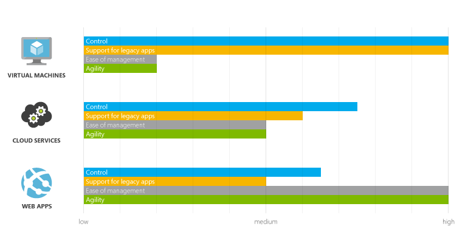
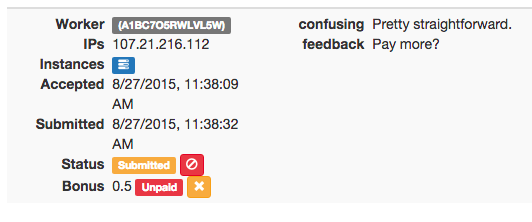
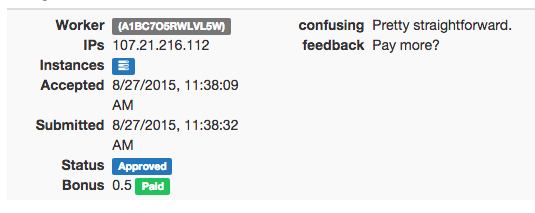

> This quick start will guide you to step by step, from install and run a local instance to deploy and test your first Turkserver app in real world.  


Version: 0.5.0

Example project: [Tutorial](https://github.com/VirtualLab/tutorial). 
For more information, regarding how to build this app, see [here](/tutorial.html).




</p><div markdown="1" class="block current"><p>
## ***Background***

[TurkServer](https://github.com/HarvardEconCS/turkserver-meteor) is a framework based on the JavaScript app platform [Meteor](https://www.meteor.com/) that makes it easy to build interactive web-based user experiments for deployment on [Amazon Mechanical Turk](https://www.mturk.com/mturk/welcome).

This tutorial will explain how to get up and running with TurkServer. The intended audience is someone who:

1. **Is familiar with [Amazon Mechanical Turk](https://www.mturk.com/mturk/welcome)** and understands how to request and approve work. If you have never used Mechanical Turk before, we recommend you explore a bit first. Go [here](https://requester.mturk.com/) and create one of the example projects.
xs
2. **Knows the basics of the JavaScript app platform [Meteor](https://www.meteor.com/).** If you have never used Meteor before, that's fine -- it's quite easy to learn. Before continuing with this tutorial, [install](https://www.meteor.com/install) Meteor and then complete the [to-do app tutorial](https://www.meteor.com/tutorials/blaze/creating-an-app).

TurkServer is designed around the Meteor framework. There are many
reasons that Meteor is especially powerful for web development; see
[this post](http://www.quora.com/Should-I-use-Meteor-Why) for a
summary. But more importantly, there are
[tons of learning resources](https://www.meteor.com/learn) for new
users to get started. The design philosophy of TurkServer is to stick
to standard Meteor as much as possible, while minimizing the need to
use custom APIs. This means that most of the outstanding Meteor
documentation on the Internet will be useful, and that most of the
required knowledge is not specific to TurkServer.

All the code for the project that you will build during the tutorial can be found [here](https://github.com/VirtualLab/tutorial). If you have questions, comments, or suggestions, please add a Github issue to that repo.

## ***The Basics***

Before getting started, it will help to define some terminology used by TurkServer. Many of these concepts are from Mechanical Turk, and should therefore be familiar to you, but others will be new.

- **Worker**: A Mechanical Turk user.
- **HIT**: A task that workers can complete on Mechanical Turk. A HIT
  can be completed by multiple workers, but each worker can only
  complete a particular HIT once.
- **External Question**: A HIT with an
  [external question](http://docs.aws.amazon.com/AWSMechTurk/latest/AWSMturkAPI/ApiReference_ExternalQuestionArticle.html)
  is hosted on your *own website* and displayed in an iframe in the
  Worker's web browser. TurkServer facilitates the process of building
  external HITs.
- **HIT Type**: A way to define the properties of a HIT, such as its title, description, and monetary reward. Each HIT has exactly one HIT type, but you can create multiple HITs with the same HIT type (e.g. you might post a HIT on Monday and receive some data, and then post another HIT of the same HIT type on Tuesday to receive additional data).
- **Batch**: Whereas a HIT Type is Mechanical Turk's way of grouping HITs together, a batch is TurkServer's way of grouping HITs together. The HIT Type determines *Mechanical Turk properties* of a HIT; the batch defines *TurkServer properties* of a HIT. When you create a HIT type in TurkServer, you must choose a batch for it. All HITs with that HIT type then belong to that batch and have the corresponding properties.
- **Assignment**: When a worker accepts a HIT, an assignment is created. The assignment keeps track of the work that the worker does on this HIT. You can approve or reject the worker's assignment after he submits the HIT. 

In using TurkServer, every Assignment of a HIT will go through one of three states (not necessarily in a linear fashion):

1. **Lobby** -- Where a worker goes right after accepting the HIT, and also between participating in experiment instances.
2. **Experiment Instance** -- Where the worker actually completes the
   task. Experiments are a logical way of setting up interaction
   between a group of workers and can consist of any number of
   workers, including just one.
3. **Exit Survey** -- Where the worker submits the HIT.

> Each participant can be assigned to one instance at a time, but can
> participate in multiple instance over the course of a HIT, so
> that each instance can have one or more simultaneous
> participants. This supports various synchronous and longitudinal
> experiment designs.

**The developer using TurkServer is responsible for building the user
  interface for each of these stages.** In other words, TurkServer
  assumes you already have a Meteor app that controls the experience
  workers have after accepting your HIT and before submitting
  it. TurkServer is just the middleman between your app and Mechanical
  Turk. The framework will take care of connecting workers to your app
  when they accept the HIT, and submitting their work to Mechanical
  Turk when they are done with your HIT. TurkServer also allows you to
  easily monitor your experiment while in progress. But you first need
  to build the app that allows workers to complete the desired
  task. 
 
Haven't build the app yet? Don't worry, we will get you started 
with one of our basic example projects - [Tutorial](https://github.com/VirtualLab/tutorial).

So let's start the journey now! (Click the "Next" button on the right)
   

</p></div><p>
  
  
</p><div markdown="1" class="block"><p>
## ***Install***
1. **Git**

    Git is a free and open source distributed version control system designed to handle everything from small to very large projects with speed and efficiency.

    How to install? See [here](https://git-scm.com/book/en/v2/Getting-Started-Installing-Git).

    *Using GitHub has the install source is temporary until the package reaches "beta"*.

2. **Meteor**

    TurkServer is built on top of [Meteor](https://www.meteor.com/).
    
    Meteor.js is a cohesive development platform, a collection of libraries and packages that are bound together in a tidy way to make web development easier. 
        
    Meteor supports OS X, Windows, and Linux, and is simple to install. 

    ```html
    | OS      | Version             | Status | 
    |---------|---------------------|--------|
    | Windows | 10                  |    ✔   |
    | Windows | 8.1                 |    ✔   |
    | Windows | 7                   |    ✔   |
    | Windows | Server 2012         |    ✔   |
    | Windows | Server 2008         |    ✔   |
    |  Linux  | X86                 |    ✔   | 
    |  Linux  | x86_64              |    ✔   | 
    |   OSX   | 10.7(Lion) and above|    ✔   | 
    ```

    On Windows?

    [Download the official Meteor installer](https://install.meteor.com/windows)

    On OS X or Linux?

    `curl https://install.meteor.com/ | sh`  
    
</p></div><p>

</p><div markdown="1" class="block"><p>
## ***Getting Started***


1.  Checkout the project 
    > `git clone https://github.com/VirtualLab/tutorial.git`

2.  Add TurkServer package
    
    Under the root of your project, add the turkserver meteor package:
    > `cd tutorial`
    
    > `git clone https://github.com/HarvardEconCS/turkserver-meteor.git packages/turkserver` (Please note: Using GitHub has the install source is temporary until it's published as a Meteor package)
    
    > `meteor add mizzao:turkserver` (Please note: If you are using Windows Command Prompt, you might not get notified in real time, you can simple press any key during this step or use Windows Powershell instead.)

3.  Create settings file
    
    Under the root of your project, create a `settings.json` file, follow `settings-template.json`, fill in "adminPassword", "accessKeyId", and "secretAccessKey".
    (To retrieve your Amazon Mechanical Turk account key and secret pair, see [here](http://docs.aws.amazon.com/AWSMechTurk/latest/AWSMechanicalTurkGettingStartedGuide/SetUp.html)
    )
    
    The file should look like this:
    
    ```javascript
    {
      "turkserver": {
        "adminPassword": <String>, // Password you choose for the TurkServer admin deshboard
        "experiment": {
          "limit": {
            "batch": <Number> // Number of batches in experiment
          }
        },
        "mturk": {
          "sandbox": <Boolean>, // Flag to turn on and off for Amazon Mechanical Turk Sandbox test
          "accessKeyId": <String>, // Amazon Mechanical Turk account accessKeyId
          "secretAccessKey": <String>, // Amazon Mechanical Turk account secretAccessKey
          "externalUrl": <String>, // Root url of your app
          "frameHeight": <Number> // Height of the iframe in M-Turk
        }
      }
    }
    ```    
       
4.  Run your app
    > `meteor --settings settings.json`

    In your console, you should see:
    
    
    
    Open your browser, you should see:   
    
    Navigate to via http://localhost:3000/turkserver, login with your password, enter the admin dashboard:
    
    
</p></div><p>

</p><div markdown="1" class="block"><p>
## ***Deployment***

To deploy your meteor app in cloud, there are many choices.

Here we are going to use [Microsoft Azure](https://azure.microsoft.com/) as example to show you how easily you can deploy your app in a cloud.(*Free one-month trial: sign up for free and get $200 to spend on all Azure services) 

### **Understand Azure**
[Azure](https://azure.microsoft.com/en-us/overview/what-is-azure/) offers several ways to host web apps:

- [App Service](https://azure.microsoft.com/en-us/services/app-service/) (Very beginner-friendly, less manual) 

- [Cloud Services](https://azure.microsoft.com/en-us/services/cloud-services/) (Beginner-friendly, and flexible) 

- [Virtual Machines](https://azure.microsoft.com/en-us/services/virtual-machines/) (Less beginner-friendly, but much more flexible). 

- [Service Fabri](https://azure.microsoft.com/en-us/services/service-fabric/) (Less beginner-friendly, microservice-based application development)
    
    

    For more detailed comparison, see [here](https://azure.microsoft.com/en-us/documentation/articles/choose-web-site-cloud-service-vm/).

### **Deploy to Azure App Service**

1. Build App Srvice using Azure Portal
    
    Or try it [here](https://tryappservice.azure.com/).
    (Note: Please don't forget to set your `deployment credentials`.)

2. Configure App Service

    Add the following enironment variables in your Application Settings:
    - WEBSITE _ NODE _ DEFAULT _ VERSION : `0.10.40`
    - ROOT _ URL : `http://{sitename}.azurewebsites.net` or your custom domain if you've set that up
    - MONGO _ URL : (Mongo DB connection string from a MongoDB hosted on [MongoLab](https://mlab.com/) or a VM)
    - METEOR _ SETTINGS : JSON value equals to the entire contents of your `settings.json` file


3. Demeteorize and deploy

    So far, Azure hasn't enable native support for Meteor, you can track insider [here](https://feedback.azure.com/forums/169385-web-apps-formerly-websites/suggestions/6848937-add-support-for-meteor-on-azure-websites).
    
    However, you can demeteorize your meteor app to run as a "standard" nodejs app to take advantage of Azure App Service's native support with features like `high availability with auto-patching`, `built-in autoscale` and `load balancing`. 
    
     
    For **Windows** users, you can use [Azure-demeteorizer](https://github.com/christopheranderson/azure-demeteorizer).
    Make sure you install and meet all the [prerequisites](https://github.com/christopheranderson/azure-demeteorizer#prerequisites) first, (Note: Visual Studio 2013 would be the most comaptible choice for most users.)
    then Azure-demeteorizer can do all the magic for you:
    > 1. Install azure-demeteorizer globally using npm:`npm install -g christopheranderson/azure-demeteorizer`
    > 2. `cd tutorial`
    > 3. `azure-demeteorizer build`
    > 4. `azure-demeteorizer install`
    > 5. `azure-demeteorizer zip`
    > 6. `azure-demeteorizer deploy -s [sitename] -u [username] - p [password]`
        - sitename: the name of your App.
        - username: username for your site's [deployment credentials].
        - password: password for your site's [deployment credentials].
    
    >  (Note: For a full respect of your changes in **Continuous Deployment**, you need stop server during step 6.)
     
    For **Linux/Mac OSX** users, you can use [Demeteorizer](https://github.com/OnModulus/demeteorizer), however,
    you have to demeteorize first, and do a continuous deployment with Git, TFS, GitHub, or Visual Studio Team Services (Here use Git as example):
    > 1. Install Demeteorizer globally using npm`$ npm install -g demeteorizer`
    > 2. `$ cd tutorial`
    > 3. `$ demeteorizer`
    > 4. `$ cd .demeteorized/bundle/programs/server`
    > 5. `$ npm install`
    > 6. `$ MONGO_URL=mongodb://localhost:27017/test PORT=3000 ROOT_URL=http://localhost:3000 npm start`
    > If this is successful, then you can continue using `git remote` to push your app to Azure. (If you didn't choose continuous deployment using Git when you build your Azure App Service, you can manually set it up [here](https://azure.microsoft.com/en-us/documentation/articles/web-sites-publish-source-control/)).
    > 7. `$ git init`
    > 8. `$ git remote add azure  https://username@{sitename}.scm.azurewebsites.net:443/{appname}.git`
    > 9. `$ git add .`
    > 10. `$ git commit -am "Initial Commit"`
    > 11. `$ git push azure master`
    


### **Deploy to Azure Virtual Machine**

1. Build VM by Azure Portal
    
    Or try it [here](https://azure.microsoft.com/en-us/trial/free-trial-virtual-machines/).
    (Note: Please don't forget to set your deployment credentials.)
2. Deploy

    > If you build Windows VMs, (i.e. Windows Server 2012) check previous chapter about how to demetoerize and deploy your app to Azure.
    
    > If you build Linux VMs, (i.e. Ubuntu 14.04 LTS) you can use [Mupx](https://github.com/arunoda/meteor-up/tree/mupx), please continue the following steps:
    
    > 1. Install mupx globally using npm: `npm install -g mupx`
    > 2. `cd tutorial`
    > 3. `mupx init` to generate or manually add:   
         * mup.json - Meteor Up configuration file, see exmpale [here](https://github.com/arunoda/meteor-up/tree/mupx#example-file)
         * settings.json - Settings for Meteor's [settings API](http://docs.meteor.com/#meteor_settings)
    > 4. `mupx setup`
    > 5. `mupx deploy`


### **Deployment Choices**
    
```html
| Client OS | Server OS             | Solutions(Recommended) | Status | 
|-----------|-----------------------|------------------------|--------|
| Windows   | Windows               | Azure-demeteorizer     |    ✔   |
| Windows   | Linux                 | Mupx                   |    ✔   |
| Linux     | Windows               | Demeteorizer           |    ✔   |
| Linux     | Linux                 | Mupx                   |    ✔   |
```

*For other deployments on Modulus, DigitalOcean, Galaxy, please check the official deployment book [here](http://meteortips.com/deployment-tutorial/).

</p></div><p>

</p><div markdown="1" class="block"><p>
## ***Test***

This step is showing you how to do your sandbox test in Amazon Mechanical Turk, 
according to Amazon payment requirements:
`ExternalURL` - The URL of your web app, to be displayed in a frame in the Worker's web browser. This URL must use the **HTTPS** protocol.
It might take some time for you to setup your own SSL server if you are not using Azure, however, we strongly recommand you complete the test before actually make your project go live.

### **Enable SSL**
- If you have deployed your app to Azure App Service:(Recommend for beginners)

    - By default, Azure already enables HTTPS for your app with a wildcard certificate for the *.azurewebsites.net domain. 
    If you don't plan to configure a custom domain, then you can benefit from the default HTTPS certificate. 
    Read more [here](https://azure.microsoft.com/en-us/documentation/articles/web-sites-configure-ssl-certificate/)

    - For a better performance and connectivity, you can turn on websockets instead of long-polling in your App Service, simply by one-click in `Application settings` through Azure portal.

- If you have deployed your app to VMs using Mupx:
    
    - You can add SSL support following [here](https://github.com/arunoda/meteor-up/tree/mupx#ssl-support), however, you have to obtain your own SSL certificate from a certificate authority (CA) and a private key first. 


- For other deployments, you might set up your SSL manually.


### **Sandbox Test**
If you have deployed the `tutorial` app and enabled SSL successfully in a public server.
Then you can follow this step to do a sanbox test in Amazon Mechanical Turk.

1. Click on "MTurk" in the navigation pane. Create a new HIT type in the "New HIT Type" form:


    When you're done, click "Create". On the following screen, you should see a button that says "Register." Click that to register your new HIT type with Mechanical Turk.

2. Click on "HITs" in the navigation pane, select the HIT type you just created in the "Create New HIT" form:


    When you're done, click "Create".

3. Now go to the [requester sandbox](https://requestersandbox.mturk.com/) to check that your HIT was posted successfully.
Click on "Manage" in the blue toolbar, and then click on "Manage HITs individually" in the top right. You should see your HIT:


4. To test this as a sandbox worker, go to the [worker sandbox](https://workersandbox.mturk.com/mturk/) *in a different browser or Chrome incognito tab*. 
Find the HIT you just posted, click "View a HIT in this group". If all went well, your app will be loaded into an iFrame at the default route `'/'`, 
which shows the "home" template and prompts you to accept the HIT:


    Click the "Accept HIT" button. You should now be put into an experiment, which shows the content under `'/experiment'` route in your app. 
    
5. As the admin, the next thing you should do is check on the Mechanical Turk status of this assignment -- is it "submitted" and/or "approved"? 

    Click the "Refresh Assignment States" button in the "Maintenance" well at the top of the page:
    
    The **Status** field of the assignment should now change from "Unknown" to "Submitted":
    
    
    This means that Mechanical Turk knows that this assignment has been completed, but it has not yet been approved. We set the "Auto Approval Delay in Seconds" property of our HIT Type to a whole week, so we need to manually approve this assignment if we want it approved before then. Click the "Approve All Assignments" button in the "Maintenance" well to do this. You'll see a popup that asks you to confirm -- feel free to leave the message blank, and hit "Ok." The **Status** field of the assignment should now change from "Submitted" to "Approved."

6. Now that the assignment is approved, we can pay the worker's bonus. 

    Click the "Pay All Bonuses" button in the "Maintenance" well. You'll again see a popup that asks you to confirm -- you do need to enter a message here, which will included in the email that Mechanical Turk sends to the worker to notify him of the bonus. When you click okay, you'll see that the **Bonus** field of the assignment now has a "Paid" label next to it:
    

    Assuming your worker sandbox account is tied to a real e-mail address, you should soon receive the corresponding notification e-mail. 
    
    **Congratulations!** -- You have successfully posted a HIT, completed it, and paid yourself for doing so.


</p></div><p>

</p><div markdown="1" class="block"><p>

## ***Read to launch***

**Congratulations!** Now, you can you made it! You can modify the demo, turn off sandbox in setting and launch your own experiments in Amazon Mturk!

## ***Reference***

Turkserver v0.5.0 API Reference:  See [Turkserver.meteorapp.com](https://turkserver.meteorapp.com/)

If you have any question: Please contact the developer [here](https://kgao.github.io/#contact)
</p></div><p>